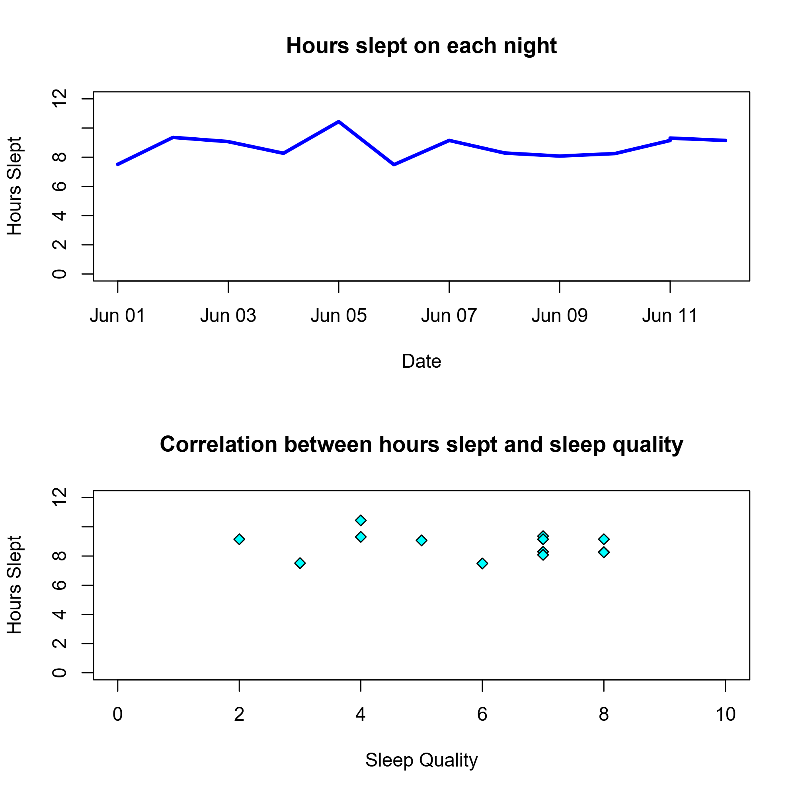

# Sleep Tracker in R

An R application for logging sleep sessions, storing entries in a local CSV file, and visualizing sleep trends over time.

This project allows a user to:

- Add new sleep entries
- Store sleep session data in `sleep.csv`
- View saved sleep data with generated built-in visualizations.
- Use visulizations for sleep analysis
- Identify trends in hours slept and sleep quality

## Project Status

This is a simple interactive R program built for local use.

Development note: written with little to no AI assistance.

## Files

| File                | Purpose                                      |
| ------------------- | -------------------------------------------- |
| `basic_program.R` | Main R script for running the sleep tracker  |
| `sleep.csv`       | Sleep log file created after the first entry |
| `README.md`       | Project documentation                        |
| `LICENSE`         | Project license                              |

## Requirements

- R installed on your computer
- A terminal or R console
- The project files saved in the same directory

## How to Use

### 1. Start R interactive mode

Open R from your terminal, R console, or VS Code.

### 2. Run the program

From inside the project folder, run:

`source("basic_program.R")`

### 3. Select a menu option

The program will display a menu. Type the number for the option you want, then press `Enter`.

## Menu Options

### 1. Add New Sleep Entry

Adds a new sleep session to the sleep log.

If `sleep.csv` does not already exist, the program creates it automatically.

### 2. Look at Sleep Data

Displays stored sleep data and generates graphs if entries exist.

The visualizations show:

- Hours slept per entry over time
- Sleep quality compared with hours slept

If no sleep entries exist, the program will show an error instead.

### 3. Quit

Exits the program.

## Data Storage

Sleep entries are stored locally in:

`sleep.csv`

This file is created automatically after the first sleep entry.

## Purpose

The purpose of this project is to practice R programming while creating a useful tool for tracking sleep habits and reviewing trends over time.

## Example Graphs

<pre class="overflow-visible! px-0!" data-start="1313" data-end="1467">

<pre class="cm-content q9tKkq_readonly m-0"><code></code></pre>

</pre>
